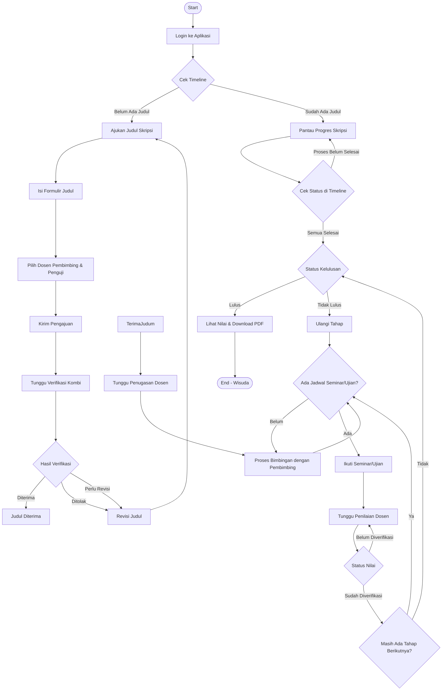
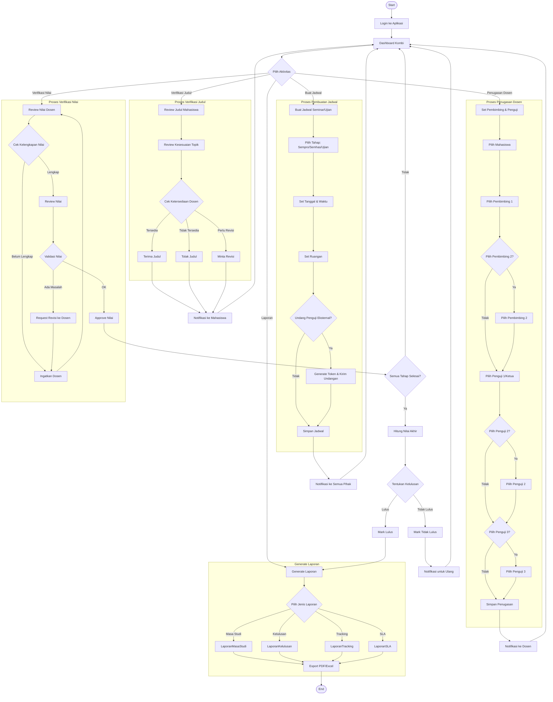
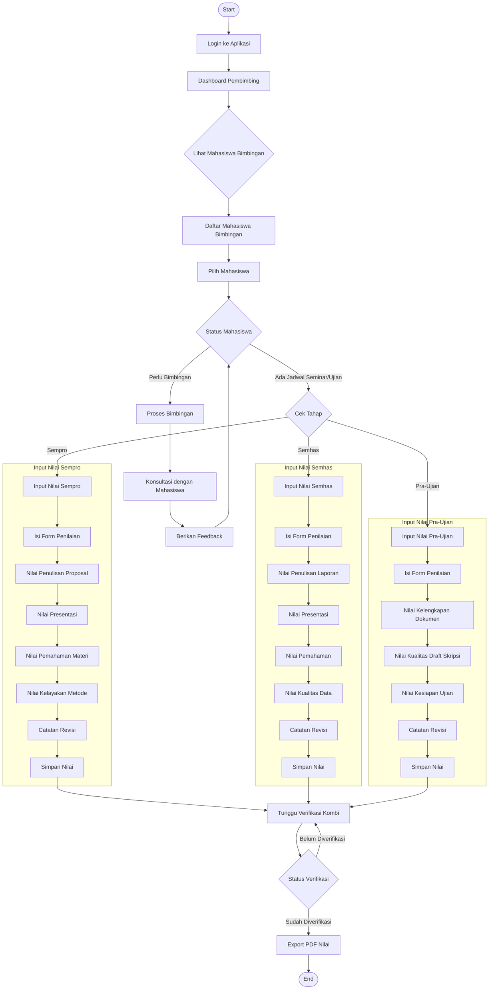
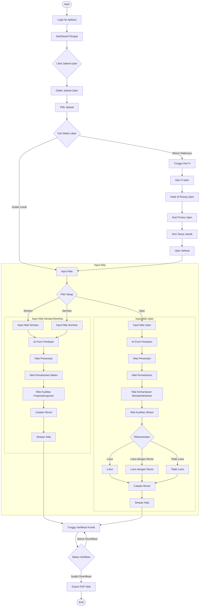
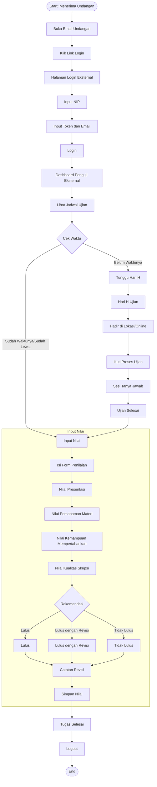

# BPMN Alur Kerja Aplikasi KBS (Komisi Bimbingan Skripsi)

## Diagram Alur Kerja per Role (BPMN Style)

---

## 1. MAHASISWA - Alur Kerja Lengkap



### BPMN Notation - Mahasiswa

| Simbol | Deskripsi |
|--------|-----------|
| ⚪ Start Event | Memulai proses |
| ⬛ Task/Activity | Aktivitas yang dilakukan |
| ◇ Gateway | Keputusan/branching |
| ⚫ End Event | Selesai proses |

---

## 2. KOMBI - Alur Kerja Lengkap



---

## 3. DOSEN PEMBIMBING - Alur Kerja



---

## 4. DOSEN PENGUJI - Alur Kerja



---

## 5. PENGUJI EKSTERNAL - Alur Kerja



---

## 6. SUPERADMIN - Alur Kerja

```mermaid
flowchart TD
    Start([Start]) --> Login[Login ke Aplikasi]
    Login --> Dashboard[Dashboard Superadmin]
    
    Dashboard --> PilihMenu{Pilih Menu}
    
    PilihMenu -->|Manajemen User| ManajemenUser
    PilihMenu -->|Pengaturan Sistem| PengaturanSistem
    PilihMenu -->|Backup & Restore| BackupRestore
    PilihMenu -->|Laporan| Laporan
    PilihMenu -->|Monitoring| Monitoring
    
    subgraph "Manajemen User"
        ManajemenUser --> PilihAksi{Pilih Aksi}
        PilihAksi -->|Tambah User| TambahUser[Buat User Baru]
        PilihAksi -->|Edit User| EditUser[Edit User]
        PilihAksi -->|Reset Password| ResetPassword[Reset Password]
        PilihAksi -->|Hapus User| HapusUser[Hapus User]
        PilihAksi -->|Import| ImportUser[Import User dari CSV]
        PilihAksi -->|Kelola Role| KelolaRole[Kelola Role User]
        
        TambahUser --> IsiDataUser[Isi Data User]
        IsiDataUser --> SetRole[Set Role]
        SetRole --> SimpanUser[Simpan User]
        
        EditUser --> PilihUserEdit[Pilih User]
        PilihUserEdit --> UpdateData[Update Data]
        UpdateData --> SimpanEdit[Simpan Perubahan]
        
        ResetPassword --> PilihUserReset[Pilih User]
        PilihUserReset --> GeneratePassword[Generate Password Baru]
        GeneratePassword --> KirimPassword[Kirim Password ke User]
        
        HapusUser --> PilihUserHapus[Pilih User]
        PilihUserHapus --> KonfirmasiHapus{Konfirmasi Hapus}
        KonfirmasiHapus -->|Ya| DeleteUser[Hapus User]
        KonfirmasiHapus -->|Tidak| PilihAksi
        
        KelolaRole --> PilihUserRole[Pilih User]
        PilihUserRole --> TambahRole[Tambah Role]
        TambahRole --> HapusRole[Hapus Role]
        HapusRole --> SimpanRole[Simpan Role]
    end
    
    subgraph "Pengaturan Sistem"
        PengaturanSistem --> PilihPengaturan{Pilih Pengaturan}
        PilihPengaturan -->|Angkatan Aktif| AturAngkatan[Atur Angkatan Aktif]
        PilihPengaturan -->|Visibility Nilai| AturVisibility[Atur Visibility Nilai]
        PilihPengaturan -->|Backup| AturBackup[Atur Konfigurasi Backup]
        PilihPengaturan -->|Email| AturEmail[Atur Konfigurasi Email]
        
        AturAngkatan --> PilihAngkatan[Pilih Angkatan]
        PilihAngkatan --> SimpanAngkatan[Simpan Pengaturan]
        
        AturVisibility --> PilihTahap[Pilih Tahap]
        PilihTahap --> SetVisibility[Set Visibility]
        SetVisibility --> SimpanVisibility[Simpan Pengaturan]
        
        AturBackup --> SetPath[Set Path Backup]
        SetPath --> SetRetention[Set Retensi]
        SetRetention --> SetSchedule[Set Jadwal Backup]
        SetSchedule --> SimpanBackup[Simpan Pengaturan]
        
        AturEmail --> SetSMTP[Set Konfigurasi SMTP]
        SetSMTP --> TestEmail[Test Email]
        TestEmail --> SimpanEmail[Simpan Pengaturan]
    end
    
    subgraph "Backup & Restore"
        BackupRestore --> PilihAksiBackup{Pilih Aksi}
        PilihAksiBackup -->|Backup Manual| BackupManual[Backup Sekarang]
        PilihAksiBackup -->|Restore| RestoreDB[Restore dari Backup]
        PilihAksiBackup -->|Lihat History| LihatHistory[Lihat History Backup]
        
        BackupManual --> PilihDatabase[Pilih Database]
        PilihDatabase --> ExecuteBackup[Execute Backup]
        ExecuteBackup --> DownloadBackup[Download File Backup]
        
        RestoreDB --> UploadFile[Upload File Backup]
        UploadFile --> VerifyBackup[Verify Backup]
        VerifyBackup --> ExecuteRestore[Execute Restore]
        
        LihatHistory --> ListBackup[Daftar Backup]
        ListBackup --> DownloadBackup
        ListBackup --> DeleteBackup[Hapus Backup]
    end
    
    subgraph "Laporan"
        Laporan --> PilihJenisLaporan{Pilih Jenis}
        PilihJenisLaporan -->|User Activity| LaporanUser[Laporan Aktivitas User]
        PilihJenisLaporan -->|System| LaporanSystem[Laporan Sistem]
        PilihJenisLaporan -->|Audit Trail| LaporanAudit[Laporan Audit Trail]
        
        LaporanUser --> SetFilterUser[Set Filter]
        SetFilterUser --> GenerateUser[Generate Laporan]
        GenerateUser --> ExportUser[Export PDF/Excel]
        
        LaporanSystem --> CekHealth[Cek Health System]
        CekHealth --> GenerateSystem[Generate Laporan]
        GenerateSystem --> ExportSystem[Export PDF/Excel]
        
        LaporanAudit --> SetFilterAudit[Set Filter]
        SetFilterAudit --> GenerateAudit[Generate Laporan]
        GenerateAudit --> ExportAudit[Export PDF/Excel]
    end
    
    subgraph "Monitoring"
        Monitoring --> CekPerformance{Cek Performance}
        CekPerformance -->|Database| MonitorDB[Monitor Database]
        CekPerformance -->|Storage| MonitorStorage[Monitor Storage]
        CekPerformance -->|User Online| MonitorUser[Monitor User Online]
        
        MonitorDB --> CekConnection[Cek Koneksi]
        CekConnection --> CekQueryTime[Cek Query Time]
        
        MonitorStorage --> CekDiskSpace[Cek Disk Space]
        CekDiskSpace --> CekBackupSize[Cek Backup Size]
        
        MonitorUser --> ListOnline[Daftar User Online]
        ListOnline --> CekActivity[Cek Activity]
    end
    
    SimpanUser --> Dashboard
    SimpanEdit --> Dashboard
    KirimPassword --> Dashboard
    DeleteUser --> Dashboard
    SimpanRole --> Dashboard
    SimpanAngkatan --> Dashboard
    SimpanVisibility --> Dashboard
    SimpanBackup --> Dashboard
    SimpanEmail --> Dashboard
    DownloadBackup --> Dashboard
    ExecuteRestore --> Dashboard
    DeleteBackup --> Dashboard
    ExportUser --> Dashboard
    ExportSystem --> Dashboard
    ExportAudit --> Dashboard
    CekQueryTime --> Dashboard
    CekBackupSize --> Dashboard
    CekActivity --> Dashboard
    
    End([End])
```

---

## 7. ALUR KERJA BERSAMA (COLLABORATION)

### Diagram Kolaborasi - Proses Lengkap Skripsi

```mermaid
sequenceDiagram
    participant M as Mahasiswa
    participant K as Kombi
    participant DP as Dosen Pembimbing
    participant P as Dosen Penguji
    participant E as Penguji Eksternal
    participant S as Sistem
    
    M->>S: Login
    K->>S: Login
    DP->>S: Login
    P->>S: Login
    
    Note over M,S: Tahap 1: Pengajuan Judul
    M->>S: Ajukan Judul
    S->>K: Notifikasi: Judul Baru
    K->>S: Review Judul
    K->>S: Terima/Tolak Judul
    S->>M: Notifikasi: Hasil Verifikasi
    
    Note over K,S: Tahap 2: Penugasan Dosen
    K->>S: Set Pembimbing & Penguji
    S->>DP: Notifikasi: Penugasan Pembimbing
    S->>P: Notifikasi: Penugasan Penguji
    
    Note over M,DP: Tahap 3: Proses Bimbingan
    M->>DP: Konsultasi
    DP->>M: Feedback
    
    Note over K,S: Tahap 4: Jadwal Seminar
    K->>S: Buat Jadwal Sempro
    S->>M: Notifikasi: Jadwal
    S->>DP: Notifikasi: Jadwal
    S->>P: Notifikasi: Jadwal
    K->>E: Undang Penguji Eksternal
    E->>S: Login dengan Token
    
    Note over M,P,E: Tahap 5: Hari H Seminar
    M->>S: Hadir Seminar
    DP->>S: Hadir Seminar
    P->>S: Hadir Seminar
    E->>S: Hadir Seminar
    
    Note over DP,P,E: Tahap 6: Input Nilai
    DP->>S: Input Nilai
    P->>S: Input Nilai
    E->>S: Input Nilai
    
    Note over K,S: Tahap 7: Verifikasi Nilai
    S->>K: Notifikasi: Nilai Masuk
    K->>S: Review & Approve Nilai
    
    Note over M,S: Tahap 8: Mahasiswa Lihat Hasil
    S->>M: Notifikasi: Nilai Terverifikasi
    M->>S: Lihat Timeline & Nilai
    
    Note over M,K,S: Tahap 9-11: Ulangi untuk Semhas, Pra-Ujian, Ujian
    
    Note over K,S: Tahap 12: Kelulusan
    K->>S: Hitung Nilai Akhir
    K->>S: Tentukan Kelulusan
    S->>M: Notifikasi: Status Kelulusan
    
    Note over M,S: Tahap 13: Selesai
    M->>S: Download Nilai & Laporan
```

---

## Legenda BPMN

| Simbol BPMN | Deskripsi | Penggunaan di Dokumen Ini |
|-------------|-----------|---------------------------|
| ⚪ Circle | Start Event | Memulai proses |
| ⬛ Rectangle | Task/Activity | Aktivitas yang dilakukan user |
| ◇ Diamond | Gateway (XOR) | Keputusan ya/tidak |
| ⬠ Rounded Rectangle | Sub-process | Proses yang memiliki detail tersendiri |
| ⚫ Circle with thick border | End Event | Mengakhiri proses |
| → Arrow | Sequence Flow | Alur proses |
| --.→ Dashed Arrow | Message Flow | Komunikasi antar user |
| Note | Annotation | Catatan tambahan |

---

## Catatan Penting

1. **BPMN dalam Markdown**: Diagram di atas menggunakan sintaks Mermaid yang dapat dirender di GitHub, GitLab, dan platform Markdown lainnya.

2. **Simplifikasi**: Beberapa elemen BPMN disederhanakan untuk kemudahan pemahaman. Untuk implementasi BPMN yang lebih detail, dapat menggunakan tools seperti Camunda, Bizagi, atau Signavio.

3. **Ekstensi**: File ini dapat dikonversi ke format BPMN standar (.bpmn) menggunakan tools seperti Mermaid CLI atau draw.io.

4. **Customization**: Setiap institusi dapat menyesuaikan alur kerja sesuai dengan kebijakan internal masing-masing.

---

*Dokumentasi BPMN ini disusun untuk memvisualisasikan alur kerja aplikasi KBS secara standar dan mudah dipahami.*
