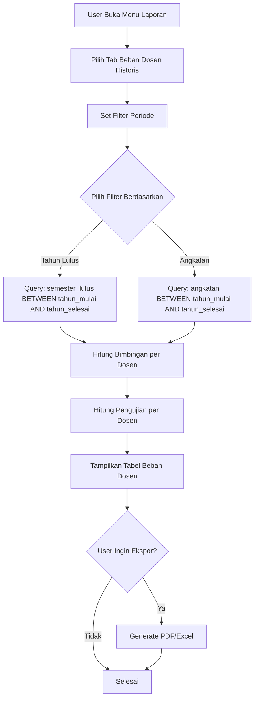

# Desain Fitur: Laporan Beban Dosen Historis

## 1. Ringkasan Kebutuhan

### Masalah Saat Ini
- Laporan "Beban Dosen" hanya menampilkan mahasiswa aktif
- Mahasiswa yang sudah lulus hilang dari beban dosen
- Tidak ada tracking historis untuk keperluan akreditasi prodi

### Solusi yang Dibutuhkan
- Laporan beban dosen yang mencakup mahasiswa aktif DAN lulus
- Filter periode waktu (tahun mulai - tahun selesai) untuk akreditasi
- Rekap jumlah bimbingan dan pengujian per dosen dalam periode tertentu
- Fitur ekspor untuk keperluan akreditasi

---

## 2. Analisis Database yang Ada

### Tabel yang Relevan

#### `students`
```sql
- id: INT
- nim: VARCHAR(15)
- name: VARCHAR(100)
- angkatan: INT (tahun masuk)
- semester_masuk: INT
- semester_lulus: INT (NULL jika belum lulus)
- status: ENUM('AKTIF', 'CUTI', 'NON-AKTIF', 'MENGULANG', 'LULUS')
```

#### `assignments`
```sql
- id: INT
- student_id: INT
- lecturer_id: INT (referensi ke users.id)
- role: ENUM('pembimbing_1', 'pembimbing_2', 'penguji_1', 'penguji_2', 'penguji_3')
- effective_date: DATE
- created_at: TIMESTAMP
```

#### `events`
```sql
- id: INT
- student_id: INT
- type: ENUM('SEMPRO', 'SEMHAS', 'PRA_UJIAN', 'UJIAN_SKRIPSI')
- scheduled_date: DATE
- status: ENUM('MENUNGGU', 'SELESAI', 'BATAL')
```

### Kesimpulan Database
**Tidak perlu modifikasi database baru**. Data yang diperlukan sudah tersedia:
- `assignments.lecturer_id` untuk menghitung bimbingan/pengujian
- `students.semester_lulus` untuk memfilter mahasiswa lulus
- `students.angkatan` untuk filter periode

---

## 3. Desain Query untuk Laporan Historis

### 3.1 Query Dasar (Tanpa Filter Periode)
```sql
SELECT u.id, u.name,
  SUM(CASE WHEN a.role IN ('pembimbing_1', 'pembimbing_2') THEN 1 ELSE 0 END) AS pembimbing_count,
  SUM(CASE WHEN a.role LIKE 'penguji%' THEN 1 ELSE 0 END) AS penguji_count
FROM assignments a
JOIN students s ON s.id = a.student_id
JOIN users u ON a.lecturer_id = u.id
-- TANPA filter: s.status != 'LULUS' (seperti workload saat ini)
GROUP BY u.id, u.name
ORDER BY u.name
```

### 3.2 Query dengan Filter Periode (Berdasarkan Tahun Lulus)
```sql
-- Untuk periode 2020-2023: mahasiswa yang lulus tahun 2020-2023 ATAU belum lulus
SELECT u.id, u.name,
  SUM(CASE WHEN a.role IN ('pembimbing_1', 'pembimbing_2') THEN 1 ELSE 0 END) AS pembimbing_count,
  SUM(CASE WHEN a.role LIKE 'penguji%' THEN 1 ELSE 0 END) AS penguji_count
FROM assignments a
JOIN students s ON s.id = a.student_id
JOIN users u ON a.lecturer_id = u.id
WHERE (
  -- Mahasiswa lulus dalam periode yang dipilih
  (s.status = 'LULUS' AND s.semester_lulus IS NOT NULL AND 
   EXTRACT(YEAR FROM s.semester_lulus) BETWEEN :tahun_mulai AND :tahun_selesai)
  OR
  -- Mahasiswa belum lulus (masih aktif)
  (s.status != 'LULUS' OR s.status IS NULL)
)
GROUP BY u.id, u.name
ORDER BY u.name
```

### 3.3 Query dengan Filter Periode (Berdasarkan Tahun Masuk/Angkatan)
```sql
-- Alternatif: filter berdasarkan angkatan mahasiswa
SELECT u.id, u.name,
  SUM(CASE WHEN a.role IN ('pembimbing_1', 'pembimbing_2') THEN 1 ELSE 0 END) AS pembimbing_count,
  SUM(CASE WHEN a.role LIKE 'penguji%' THEN 1 ELSE 0 END) AS penguji_count
FROM assignments a
JOIN students s ON s.id = a.student_id
JOIN users u ON a.lecturer_id = u.id
WHERE s.angkatan BETWEEN :tahun_mulai AND :tahun_selesai
GROUP BY u.id, u.name
ORDER BY u.name
```

---

## 4. Desain Antarmuka (UI)

### 4.1 Navigasi
Tambahkan tab baru di [`src/views/reports/_nav.php`](src/views/reports/_nav.php):
```php
'historical_workload' => ['label' => 'Beban Dosen Historis', 'url' => '/reports/historical-workload']
```

### 4.2 Halaman Laporan
**File:** [`src/views/reports/historical_workload.php`](src/views/reports/historical_workload.php)

#### Filter Section
- **Tahun Mulai** (dropdown/select): 2010 - Tahun sekarang
- **Tahun Selesai** (dropdown/select): 2010 - Tahun sekarang
- **Filter Berdasarkan**: 
  - [ ] Tahun Lulus Mahasiswa
  - [ ] Angkatan Mahasiswa
- **Cari Dosen** (search box): Filter nama dosen
- **Tombol**: Terapkan, Reset

#### Summary Cards
- Total Dosen dalam periode
- Total Bimbingan dalam periode
- Total Pengujian dalam periode

#### Tabel Beban Dosen
| Nama Dosen | Total Bimbingan | Total Pengujian | Detail |
|------------|-----------------|-----------------|---------|
| Dosen A    | 15 mhs          | 20 mhs          | [Lihat] |
| Dosen B    | 12 mhs          | 18 mhs          | [Lihat] |

#### Detail per Dosen (Modal/Expand)
- Breakdown per angkatan/tahun lulus
- Daftar mahasiswa yang dibimbing
- Daftar mahasiswa yang diuji

### 4.3 Tombol Ekspor
- **Ekspor PDF**: Untuk laporan akreditasi
- **Ekspor Excel**: Untuk analisis lebih lanjut

---

## 5. Implementasi Teknis

### 5.1 Service Layer
**File:** [`src/services/ReportService.php`](src/services/ReportService.php)

Method baru: `getHistoricalWorkloadData($tahunMulai, $tahunSelesai, $filterBy, $lecturerSearch)`

Parameter:
- `$tahunMulai`: int (tahun awal periode)
- `$tahunSelesai`: int (tahun akhir periode)
- `$filterBy`: string ('tahun_lulus' atau 'angkatan')
- `$lecturerSearch`: string (nama dosen untuk filter)

Return:
```php
[
  'workloads' => [
    [
      'id' => 1,
      'name' => 'Dosen A',
      'pembimbing_count' => 15,
      'penguji_count' => 20,
      'pembimbing_by_period' => [
        '2020' => 5,
        '2021' => 7,
        '2022' => 3
      ],
      'penguji_by_period' => [
        '2020' => 8,
        '2021' => 7,
        '2022' => 5
      ]
    ],
    // ...
  ],
  'totals' => [
    'dosen' => 25,
    'total_bimbingan' => 150,
    'total_penguji' => 200
  ],
  'periodList' => [2020, 2021, 2022, 2023]
]
```

### 5.2 Controller Layer
**File:** [`src/controllers/ReportController.php`](src/controllers/ReportController.php)

Method baru: `historicalWorkload()`

```php
public function historicalWorkload()
{
    $this->ensureAccess();
    
    $tahunMulai = isset($_GET['tahun_mulai']) ? (int)$_GET['tahun_mulai'] : null;
    $tahunSelesai = isset($_GET['tahun_selesai']) ? (int)$_GET['tahun_selesai'] : null;
    $filterBy = $_GET['filter_by'] ?? 'tahun_lulus';
    $lecturerSearch = trim($_GET['search'] ?? '');
    
    // Default: 5 tahun terakhir
    if (!$tahunMulai || !$tahunSelesai) {
        $currentYear = (int)date('Y');
        $tahunMulai = $currentYear - 5;
        $tahunSelesai = $currentYear;
    }
    
    $data = $this->reportService->getHistoricalWorkloadData(
        $tahunMulai, 
        $tahunSelesai, 
        $filterBy, 
        $lecturerSearch
    );
    
    $this->render('reports/historical_workload', array_merge($data, [
        'activeTab' => 'historical_workload',
        'selectedTahunMulai' => $tahunMulai,
        'selectedTahunSelesai' => $tahunSelesai,
        'selectedFilterBy' => $filterBy,
        'currentSearch' => $lecturerSearch
    ]));
}
```

### 5.3 Routes
**File:** [`src/config/routes.php`](src/config/routes.php)

Tambahkan:
```php
'/reports/historical-workload' => 'ReportController@historicalWorkload',
```

---

## 6. Flowchart Alur Kerja



---

## 7. Contoh Use Case Akreditasi

### Skenario: Akreditasi Tahun 2024
Prodi perlu melaporkan beban dosen untuk periode **2020-2023**:

1. Admin buka menu "Laporan & Monitoring"
2. Pilih tab "Beban Dosen Historis"
3. Set filter:
   - Tahun Mulai: **2020**
   - Tahun Selesai: **2023**
   - Filter Berdasarkan: **Tahun Lulus Mahasiswa**
4. Klik "Terapkan"
5. Sistem menampilkan:
   - Dosen A: 25 bimbingan, 30 pengujian (periode 2020-2023)
   - Dosen B: 20 bimbingan, 25 pengujian (periode 2020-2023)
   - ...dst
6. Admin klik "Ekspor PDF"
7. PDF digunakan untuk dokumen akreditasi

---

## 8. Prioritas Implementasi

### Phase 1 (Core Features)
1. Method `getHistoricalWorkloadData` di ReportService
2. Controller method `historicalWorkload`
3. View basic dengan filter periode
4. Tab navigasi

### Phase 2 (Enhancement)
1. Breakdown per periode (detail per tahun)
2. Modal detail per dosen
3. Ekspor PDF

### Phase 3 (Optional)
1. Ekspor Excel
2. Grafik visualisasi
3. Filter tambahan (status dosen, prodi)

---

## 9. Catatan Penting

1. **Perbedaan dengan workload saat ini**:
   - Workload saat ini: Hanya mahasiswa aktif (`s.status != 'LULUS'`)
   - Historical workload: Mahasiswa aktif + lulus dalam periode

2. **Query semester_lulus**:
   - `semester_lulus` disimpan sebagai angka (misal: 20221 untuk ganjil 2022)
   - Perlu `EXTRACT(YEAR FROM ...)` atau parsing manual

3. **Performance**:
   - Query mungkin berat jika data banyak
   - Pertimbangkan indexing pada kolom `semester_lulus` dan `angkatan`

4. **Ekspor PDF**:
   - Gunakan library FPDF yang sudah ada
   - Format sesuai kebutuhan akreditasi (biasanya tabel formal)
