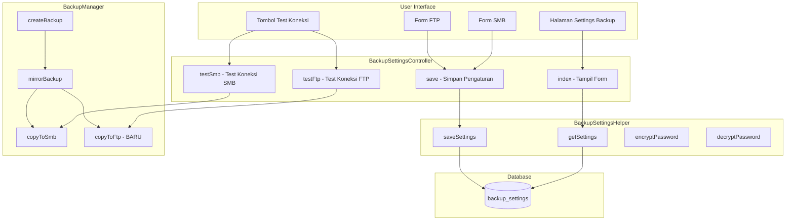

# Rencana Pengaturan Backup SMB/FTP

## 1. Analisis Sistem Saat Ini

### Konfigurasi Saat Ini
- **Lokasi:** `src/config/backup.php`
- **Sumber:** Environment variables (`.env`)
- **Tipe yang didukung:** Local path dan SMB saja
- **Keterbatasan:** 
 - Tidak ada UI untuk mengubah pengaturan
 - Harus edit `.env` manual
 - Tidak ada FTP support
 - Tidak ada test koneksi

### Environment Variables yang Digunakan
```
BACKUP_STORAGE_PATH
BACKUP_EXTERNAL_TYPE (path/smb)
BACKUP_EXTERNAL_PATH
BACKUP_SMB_HOST
BACKUP_SMB_SHARE
BACKUP_SMB_PATH
BACKUP_SMB_USERNAME
BACKUP_SMB_PASSWORD
BACKUP_SMB_BINARY
BACKUP_SMB_WORKGROUP
BACKUP_RETENTION_DAYS
```

---

## 2. Desain Skema Database

### Tabel: `backup_settings`

| Kolom | Tipe | Default | Keterangan |
|-------|------|---------|------------|
| `id` | INT AUTO_INCREMENT | - | Primary key |
| `backup_enabled` | TINYINT(1) | 1 | Aktif/nonaktif backup otomatis |
| `backup_type` | ENUM | 'local' | Tipe: 'local', 'smb', 'ftp', 'none' |
| `retention_days` | INT | 30 | Hari penyimpanan backup |
| `smb_enabled` | TINYINT(1) | 0 | Aktif/nonaktif SMB |
| `smb_host` | VARCHAR(255) | NULL | Host SMB |
| `smb_share` | VARCHAR(255) | NULL | Nama share |
| `smb_path` | VARCHAR(255) | NULL | Path di dalam share |
| `smb_username` | VARCHAR(100) | NULL | Username SMB |
| `smb_password` | VARCHAR(255) | NULL | Password SMB (encrypted) |
| `smb_workgroup` | VARCHAR(100) | NULL | Workgroup/Domain |
| `smb_binary` | VARCHAR(255) | '/usr/bin/smbclient' | Path smbclient |
| `ftp_enabled` | TINYINT(1) | 0 | Aktif/nonaktif FTP |
| `ftp_host` | VARCHAR(255) | NULL | Host FTP |
| `ftp_port` | INT | 21 | Port FTP |
| `ftp_username` | VARCHAR(100) | NULL | Username FTP |
| `ftp_password` | VARCHAR(255) | NULL | Password FTP (encrypted) |
| `ftp_path` | VARCHAR(255) | NULL | Path di server FTP |
| `ftp_passive` | TINYINT(1) | 1 | Mode passive |
| `created_at` | TIMESTAMP | CURRENT_TIMESTAMP | |
| `updated_at` | TIMESTAMP | ON UPDATE | |

### SQL Migration

```sql
CREATE TABLE IF NOT EXISTS backup_settings (
 id INT AUTO_INCREMENT PRIMARY KEY,
 backup_enabled TINYINT(1) NOT NULL DEFAULT 1,
 backup_type ENUM('local', 'smb', 'ftp', 'none') NOT NULL DEFAULT 'local',
 retention_days INT NOT NULL DEFAULT 30,
 
 -- SMB Settings
 smb_enabled TINYINT(1) NOT NULL DEFAULT 0,
 smb_host VARCHAR(255) NULL,
 smb_share VARCHAR(255) NULL,
 smb_path VARCHAR(255) NULL,
 smb_username VARCHAR(100) NULL,
 smb_password VARCHAR(255) NULL,
 smb_workgroup VARCHAR(100) NULL,
 smb_binary VARCHAR(255) DEFAULT '/usr/bin/smbclient',
 
 -- FTP Settings
 ftp_enabled TINYINT(1) NOT NULL DEFAULT 0,
 ftp_host VARCHAR(255) NULL,
 ftp_port INT DEFAULT 21,
 ftp_username VARCHAR(100) NULL,
 ftp_password VARCHAR(255) NULL,
 ftp_path VARCHAR(255) NULL,
 ftp_passive TINYINT(1) DEFAULT 1,
 
 created_at TIMESTAMP DEFAULT CURRENT_TIMESTAMP,
 updated_at TIMESTAMP DEFAULT CURRENT_TIMESTAMP ON UPDATE CURRENT_TIMESTAMP
) ENGINE=InnoDB DEFAULT CHARSET=utf8mb4;

-- Insert default settings
INSERT INTO backup_settings (backup_enabled, backup_type, retention_days)
VALUES (1, 'local', 30);
```

---

## 3. Arsitektur Komponen



---

## 4. File yang Perlu Dibuat/Dimodifikasi

### File Baru
| File | Keterangan |
|------|------------|
| `migrations/add_backup_settings_table.sql` | Migration SQL |
| `src/helpers/BackupSettingsHelper.php` | Helper untuk pengaturan backup |
| `src/controllers/BackupSettingsController.php` | Controller pengaturan backup |
| `src/views/settings/backup.php` | View form pengaturan backup |

### File yang Dimodifikasi
| File | Perubahan |
|------|-----------|
| `src/helpers/BackupManager.php` | Tambah FTP support, baca dari database |
| `src/config/backup.php` | Fallback ke database jika env tidak ada |
| `src/config/routes.php` | Tambah route untuk backup settings |
| `src/views/layouts/main.php` | Tambah menu backup settings |
| `src/views/settings/index.php` | Tambah tab/section backup |

---

## 5. Alur Kerja

### 5.1 Membaca Pengaturan
1. `BackupManager` di-instantiate
2. Cek apakah ada pengaturan di database
3. Jika ada, gunakan pengaturan database
4. Jika tidak ada, fallback ke environment variables

### 5.2 Menyimpan Pengaturan
1. User mengisi form di halaman settings
2. Submit ke `BackupSettingsController::save()`
3. Validasi input
4. Enkripsi password
5. Simpan ke database
6. Tampilkan pesan sukses

### 5.3 Test Koneksi SMB
1. User klik "Test Koneksi SMB"
2. AJAX request ke `BackupSettingsController::testSmb()`
3. Gunakan `smbclient` untuk test koneksi
4. Kembalikan hasil (sukses/gagal + pesan)

### 5.4 Test Koneksi FTP
1. User klik "Test Koneksi FTP"
2. AJAX request ke `BackupSettingsController::testFtp()`
3. Gunakan `ftp_connect` dan `ftp_login`
4. Kembalikan hasil (sukses/gagal + pesan)

---

## 6. UI Mockup

### Form Pengaturan Backup

```
+--------------------------------------------------+
| PENGATURAN BACKUP                                |
+--------------------------------------------------+
|                                                  |
| [x] Aktifkan Backup Otomatis                     |
|                                                  |
| Tipe Backup: [Local v]                          |
|                                                  |
| Retensi Backup: [30] hari                       |
|                                                  |
+--------------------------------------------------+
| PENGATURAN SMB                                   |
+--------------------------------------------------+
|                                                  |
| [x] Aktifkan Sinkronisasi SMB                    |
|                                                  |
| Host SMB:     [192.168.100.145         ]         |
| Share:        [backup                  ]         |
| Path:         [/kombi                  ]         |
| Username:     [admin                   ]         |
| Password:     [********                ]         |
| Workgroup:    [WORKGROUP               ]         |
| Binary:       [/usr/bin/smbclient      ]         |
|                                                  |
| [Test Koneksi SMB]                               |
|                                                  |
+--------------------------------------------------+
| PENGATURAN FTP                                   |
+--------------------------------------------------+
|                                                  |
| [ ] Aktifkan Sinkronisasi FTP                    |
|                                                  |
| Host FTP:     [                        ]         |
| Port:         [21                     ]          |
| Username:     [                        ]         |
| Password:     [                        ]         |
| Path:         [/backup                ]          |
| [x] Mode Passive                                 |
|                                                  |
| [Test Koneksi FTP]                               |
|                                                  |
+--------------------------------------------------+
|                                                  |
| [Simpan Pengaturan]                              |
|                                                  |
+--------------------------------------------------+
```

---

## 7. Keamanan

### Password Encryption
- Password SMB dan FTP dienkripsi sebelum disimpan
- Menggunakan `openssl_encrypt()` dengan AES-256-CBC
- Key disimpan di `.env` (`BACKUP_ENCRYPTION_KEY`)

### Access Control
- Hanya `superadmin` dan `kombi` yang bisa mengakses pengaturan backup
- Validasi input di server-side

---

## 8. Implementasi FTP

### Fungsi copyToFtp() di BackupManager

```php
private function copyToFtp(string $archivePath, array $config): void
{
 $host = $config['host'];
 $port = (int)($config['port'] ?? 21);
 $username = $config['username'];
 $password = $config['password'];
 $remotePath = $config['path'] ?? '/';
 $passive = (bool)($config['passive'] ?? true);

 $conn = ftp_connect($host, $port, 30);
 if (!$conn) {
     throw new RuntimeException('Tidak dapat terhubung ke server FTP.');
 }

 if (!ftp_login($conn, $username, $password)) {
     ftp_close($conn);
     throw new RuntimeException('Login FTP gagal.');
 }

 if ($passive) {
     ftp_pasv($conn, true);
 }

 // Create directory if not exists
 $this->ftpMakeDirectory($conn, $remotePath);

 // Upload file
 $remoteFile = rtrim($remotePath, '/') . '/' . basename($archivePath);
 if (!ftp_put($conn, $remoteFile, $archivePath, FTP_BINARY)) {
     ftp_close($conn);
     throw new RuntimeException('Gagal mengunggah file ke FTP.');
 }

 ftp_close($conn);
}
```

---

## 9. Prioritas Implementasi

### Fase 1: Database & Helper
1. Buat migration SQL
2. Buat `BackupSettingsHelper.php`
3. Modifikasi `BackupManager.php` untuk baca dari database

### Fase 2: Controller & UI
4. Buat `BackupSettingsController.php`
5. Buat view `settings/backup.php`
6. Tambah route

### Fase 3: Fitur Tambahan
7. Implementasi FTP di `BackupManager.php`
8. Test koneksi SMB
9. Test koneksi FTP

### Fase 4: Dokumentasi
10. Update dokumentasi

---

## 10. Estimasi Waktu

| Fase | Kompleksitas |
|------|--------------|
| Fase 1 | Sedang |
| Fase 2 | Sedang |
| Fase 3 | Tinggi |
| Fase 4 | Rendah |

---

## 11. Catatan Tambahan

- Pastikan `smbclient` terinstal di server untuk SMB
- Pastikan extension `ftp` diaktifkan di PHP untuk FTP
- Password dienkripsi dengan kunci yang disimpan di `.env`
- Backup lokal tetap dibuat meski sinkronisasi SMB/FTP gagal
