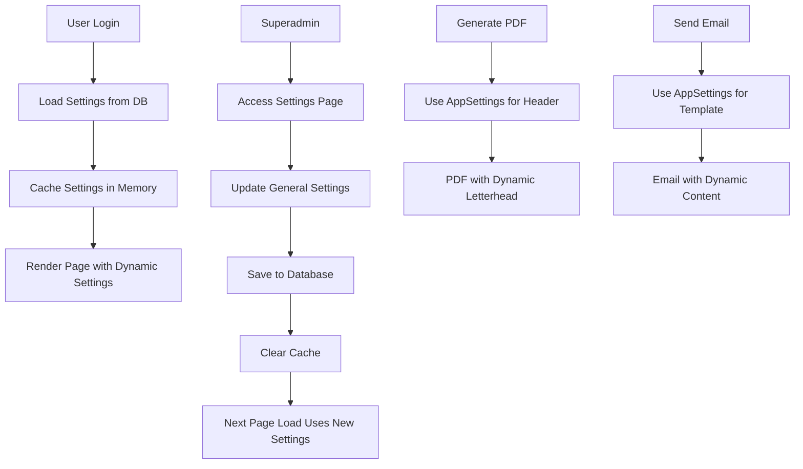

# Sistem Pengaturan Umum (General Settings)

## Tujuan
Membuat aplikasi KomBi-TIP fleksibel dan dapat digunakan oleh prodi lain dengan mudah melalui pengaturan konfigurasi.

## Analisis Kode Saat Ini

### Hardcoded Values yang Ditemukan:

1. **Nama Aplikasi**:
   - "KomBi-TIP Apps"
   - "Sistem Kombi"
   - "Sistem Komisi Bimbingan Skripsi (KomBi-TIP)"

2. **Informasi Organisasi**:
   - "Program Studi Teknologi Industri Pertanian"
   - "Fakultas Teknologi Pertanian"
   - "Universitas Jember"

3. **Logo & Visual**:
   - Logo: `/unej bw.png`
   - Favicon: `/public/images/favicon.ico`

4. **PDF Headers**:
   - Letterhead dengan logo dan info organisasi
   - Footer dengan copyright

5. **Email Templates**:
   - "Sistem Kombi" di subject dan body

### Lokasi File yang Perlu Diupdate:

1. **Layouts**:
   - `src/views/layouts/main.php` - Navbar, title
   - `src/views/layouts/app.php` - Title, navbar, footer
   - `src/views/layouts/verification.php` - Header, footer
   - `src/views/auth/login.php` - Header, footer

2. **PDF Exporter**:
   - `src/helpers/PdfExporter.php` - Letterhead, author, metadata

3. **Email Services**:
   - `src/services/EmailService.php` - Email templates
   - `src/helpers/EmailQueueHelper.php` - Email templates

4. **Controllers**:
   - `src/controllers/VerificationController.php` - Messages
   - `src/controllers/SettingsController.php` - Email from_name

5. **Config**:
   - `src/config/app.php` - App name, version

## Desain Struktur Pengaturan

### Settings Keys (menggunakan table `settings` yang sudah ada):

```sql
-- Application Settings
app_name                    -- "KomBi-TIP Apps"
app_full_name              -- "Sistem Komisi Bimbingan Skripsi"
app_short_name             -- "KomBi-TIP"
app_version                -- "1.0.0"

-- Organization Settings
org_prodi                  -- "Program Studi Teknologi Industri Pertanian"
org_fakultas               -- "Fakultas Teknologi Pertanian"
org_universitas            -- "Universitas Jember"
org_location               -- "Jember"

-- Visual Settings
app_logo_url               -- "/public/images/logo.png"
app_letterhead_logo        -- "/unej bw.png"
app_favicon_url            -- "/public/images/favicon.ico"

-- Contact/Footer Settings
app_footer_text            -- "KomBi-TIP Apps"
app_developer_name         -- "BS"
app_developer_url          -- "https://www.suryadharma.work/"
app_admin_contact          -- "admin@kombi.unej.ac.id"

-- Email Settings
email_from_name            -- "Sistem Kombi" (sudah ada)
```

## Implementasi Plan

### Phase 1: Database & Helper
1. ✅ Settings table sudah ada (key-value store)
2. Buat migration untuk insert default settings
3. Update `Settings` helper class dengan method baru untuk app settings

### Phase 2: Update Layouts
1. Update `src/views/layouts/main.php`
2. Update `src/views/layouts/app.php`
3. Update `src/views/layouts/verification.php`
4. Update `src/views/auth/login.php`

### Phase 3: Update PDF Exporter
1. Update `src/helpers/PdfExporter.php`
2. Update letterhead generation
3. Update PDF metadata

### Phase 4: Update Email Templates
1. Update `src/services/EmailService.php`
2. Update `src/helpers/EmailQueueHelper.php`

### Phase 5: Settings UI
1. Tambah section "Pengaturan Umum" di halaman settings
2. Form untuk mengubah nama aplikasi, organisasi, logo
3. Hanya superadmin yang bisa mengubah

### Phase 6: Testing
1. Test semua halaman untuk memastikan settings dinamis bekerja
2. Test PDF generation dengan header dinamis
3. Test email dengan template dinamis

## Struktur Helper Class

```php
// src/helpers/AppSettings.php

class AppSettings {
    // Application
    public static function getName(): string;
    public static function getFullName(): string;
    public static function getShortName(): string;
    public static function getVersion(): string;
    
    // Organization
    public static function getProdi(): string;
    public static function getFakultas(): string;
    public static function getUniversitas(): string;
    public static function getLocation(): string;
    public static function getFullOrganizationName(): string; // "Prodi X, Fakultas Y, Universitas Z"
    
    // Visual
    public static function getLogoUrl(): string;
    public static function getLetterheadLogo(): string;
    public static function getFaviconUrl(): string;
    
    // Contact/Footer
    public static function getFooterText(): string;
    public static function getDeveloperName(): string;
    public static function getDeveloperUrl(): string;
    public static function getAdminContact(): string;
    
    // Email
    public static function getEmailFromName(): string;
    
    // Helper methods
    public static function getCopyrightYear(): string;
    public static function getFullAppName(): string; // "Nama Aplikasi - Prodi X"
}
```

## Migration File

```sql
-- migrations/add_general_app_settings.sql

-- Insert default general app settings
INSERT INTO settings (key_name, value, description) VALUES
-- Application
('app_name', 'KomBi-TIP Apps', 'Nama aplikasi (singkat)'),
('app_full_name', 'Sistem Komisi Bimbingan Skripsi', 'Nama lengkap aplikasi'),
('app_short_name', 'KomBi-TIP', 'Nama pendek aplikasi'),
('app_version', '1.0.0', 'Versi aplikasi'),

-- Organization
('org_prodi', 'Program Studi Teknologi Industri Pertanian', 'Nama program studi'),
('org_fakultas', 'Fakultas Teknologi Pertanian', 'Nama fakultas'),
('org_universitas', 'Universitas Jember', 'Nama universitas'),
('org_location', 'Jember', 'Kota lokasi'),

-- Visual
('app_logo_url', '/public/images/logo.png', 'URL logo aplikasi'),
('app_letterhead_logo', '/unej bw.png', 'Path logo untuk kop surat PDF'),
('app_favicon_url', '/public/images/favicon.ico', 'URL favicon'),

-- Contact/Footer
('app_footer_text', 'KomBi-TIP Apps', 'Teks footer aplikasi'),
('app_developer_name', 'BS', 'Nama developer'),
('app_developer_url', 'https://www.suryadharma.work/', 'URL website developer'),
('app_admin_contact', 'admin@kombi.unej.ac.id', 'Kontak admin')

ON DUPLICATE KEY UPDATE description = VALUES(description);
```

## Contoh Penggunaan

### Di Layout:
```php
<title><?= AppSettings::getName() ?></title>
<nav><?= AppSettings::getName() ?></nav>
<footer>&copy; <?= date('Y') ?> <?= AppSettings::getFooterText() ?></footer>
```

### Di PDF:
```php
$pdf->setLetterhead($logo, [
    AppSettings::getProdi(),
    AppSettings::getFakultas(),
    AppSettings::getUniversitas()
]);
```

### Di Email:
```php
$subject = 'Notifikasi dari ' . AppSettings::getEmailFromName();
$body = 'Email dikirim oleh ' . AppSettings::getFullName();
```

## Catatan Penting

1. **Backward Compatibility**: Semua method harus return default values jika settings belum diset
2. **Caching**: Settings harus di-cache untuk performance (sudah ada di Settings class)
3. **Access Control**: Hanya superadmin yang bisa mengubah pengaturan umum
4. **Validation**: URL logo harus divalidasi (harus exist atau URL eksternal valid)
5. **Logo Upload**: Pertimbangkan fitur upload logo untuk kemudahan pengguna

## Flow Diagram



## Checklist Implementasi

- [ ] Buat migration file
- [ ] Buat AppSettings helper class
- [ ] Update layouts (main.php, app.php, verification.php, login.php)
- [ ] Update PdfExporter
- [ ] Update EmailService & EmailQueueHelper
- [ ] Update controllers yang menggunakan hardcoded values
- [ ] Tambah UI untuk settings di halaman settings
- [ ] Test semua halaman
- [ ] Test PDF generation
- [ ] Test email templates
